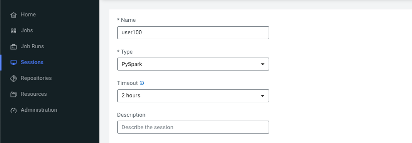
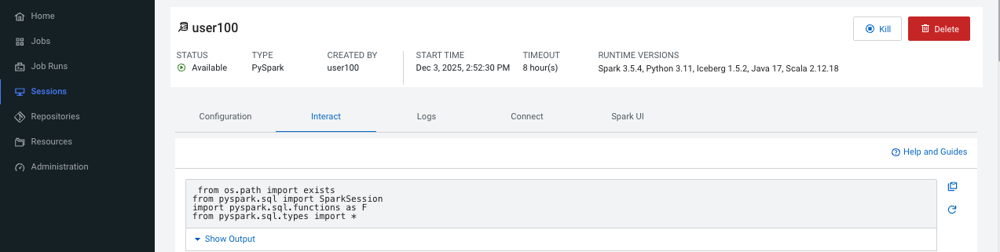
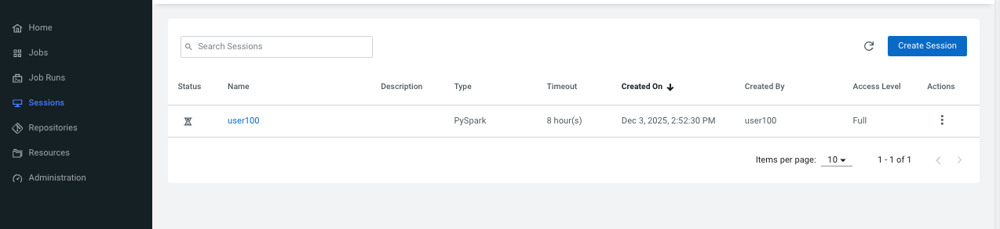

### Laboratório 4 : Executar uma Sessão Interativa PySpark

Navegue até a Página Principal do CDE e inicie uma Sessão PySpark. 
Mantenha os valores padrão inalterados.



Uma vez que a Sessão esteja pronta, abra a aba "Interact" para inserir seu código.



Você pode copiar e colar o código das instruções no notebook clicando no ícone no canto superior direito da célula de código.



Cole a célula abaixo no notebook. 
Antes de executá-la, certifique-se de ter alterado a variável "username" para o seu usuário designado.

```
from os.path import exists
from pyspark.sql import SparkSession
import pyspark.sql.functions as F
from pyspark.sql.types import * 
from pyspark.sql.functions import col, to_timestamp, lower, trim, sha2, concat_ws, lit
from pyspark.sql.functions import datediff, current_date, floor, hour, dayofweek, month
from pyspark.sql.functions import avg, sum, count, desc
from pyspark.sql.window import Window
from pyspark.sql.functions import max as max_func, lit

storageLocation = "s3a://hol-sefazsc-buk-b76c0ff7/data/warehouse/tablespace/external/hive/"
username = "user100"
db = "bancodemo_{0}.db".format(username)
```


Não são necessárias mais modificações no código. Continue executando cada fragmento de código abaixo em células separadas no notebook.

#### 1. Tabela clinte

```
clientes = "{0}/{1}/clientes/".format(storageLocation, db)


# Read the Parquet file(s) into a DataFrame
df_clientes = spark.read.parquet(clientes)

# Show the DataFrame schema and some data to verify
df_clientes.printSchema()
df_clientes.show()
```

#### 2. Tabela transacoes

```
transacoes = "{0}/{1}/transacoes_cartao/".format(storageLocation, db)

# Read the Parquet file(s) into a DataFrame
df_transacoes = spark.read.parquet(transacoes)

# Show the DataFrame schema and some data to verify
df_transacoes.printSchema()
df_transacoes.show()
```


#### 3. Ajuste de Tipos e Limpeza de Strings
```
df_transacoes_tratado = df_transacoes \
    .withColumn("data_transacao", to_timestamp("data_transacao")) \
    .withColumn("valor", col("valor").cast("double")) \
    .withColumn("categoria", lower(trim(col("categoria")))) \
    .withColumn("status", lower(trim(col("status"))))

df_transacoes_tratado.show()
```

#### 4. Mascaramento de Dados Sensíveis (LGPD) no df_clientes

```
df_clientes_tratado = df_clientes \
    .withColumn("email_hash", sha2(col("email"), 256)) \
    .withColumn("cartao_mascarado", concat_ws("", col("numero_cartao").substr(1, 4), lit("************"))) \
    .drop("email", "numero_cartao") # Remove originais

df_clientes_tratado.show()
```

#### 5. Calcular Idade do Cliente

```
df_clientes_enrich = df_clientes_tratado \
    .withColumn("idade", floor(datediff(current_date(), col("data_nascimento")) / 365.25))

df_clientes_enrich.show()
```

#### 6. Join e Extração de Tempo

```
df_full = df_transacoes_tratado \
    .withColumn("hora_transacao", hour("data_transacao")) \
    .withColumn("dia_semana", dayofweek("data_transacao")) \
    .withColumn("mes", month("data_transacao"))

# Agora df_full tem quem comprou, onde mora, idade e detalhes da compra.
df_full.show()
```

#### 7. Calcule a média e a mediana do valor da transação

```
transactionsAmountMean = round(df_transacoes.select(F.mean("valor")).collect()[0][0],2)
transactionsAmountMedian = round(df_transacoes.stat.approxQuantile("valor", [0.5], 0.001)[0],2)

print("Transaction Amount Mean: ", transactionsAmountMean)
print("Transaction Amount Median: ", transactionsAmountMedian)
```

#### 8. Crie uma visão temporaria no Spark a partir do Dataframe

```
df_full.createOrReplaceTempView("trx")
spark.sql("SELECT * FROM trx LIMIT 10").show()
```

#### 9. Calcule o número de transações por cliente

```
spark.sql("SELECT id_usuario, COUNT(*) AS COUNT FROM trx \
            GROUP BY id_usuario ORDER BY COUNT DESC LIMIT 10").show()
```

#### 10. Análise de Status das Transações

```
df_full.groupBy("status").count().show()
```

#### 11.  Ticket Médio e Total por Categoria (apenas transações aprovadas)

```
df_full.filter(col("status") == "aprovada") \
    .groupBy("categoria") \
    .agg(
        avg("valor").alias("ticket_medio"),
        sum("valor").alias("faturamento_total"),
        count("id_usuario").alias("qtd_vendas")
    ) \
    .orderBy(desc("faturamento_total")) \
    .show()
```

#### 12.  Top categorias com maior volume de gastos negados (Fraude potencial?)


```
df_full.filter(col("status") == "negada") \
    .groupBy("categoria") \
    .agg(sum("valor").alias("total_negado")) \
    .orderBy(desc("total_negado")) \
    .show()
```

#### 12.  Juntando os dois Dataframes

```
df_full = df_transacoes.join(df_clientes, "id_usuario", "left")
print("Schema após o Join:")
df_full.printSchema()
```

#### 13.  Análise de Utilização de Crédito (Gasto Aprovado / Limite)

```
df_utilizacao = df_full.filter(col("status") == "Aprovada") \
    .groupBy("id_usuario", "nome", "limite_credito") \
    .agg(sum("valor").alias("total_gasto")) \
    .withColumn("percentual_uso", (col("total_gasto") / col("limite_credito")) * 100) \
    .orderBy(desc("percentual_uso"))
```
